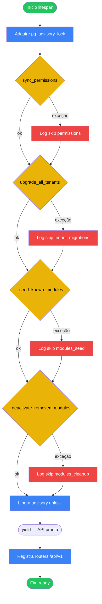

# 01 — Bootstrap / Startup da API

## A. Metadados do processo

- *Nome do processo:* Arranque da aplicação FastAPI (lifespan)
- *Trigger:* Subida do processo Uvicorn / workers; execução de `lifespan` em `backend/app/main.py`
- *Objetivo:* Serializar inicialização entre workers, sincronizar catálogo de permissões, aplicar DDL incremental em todos os tenants, seedar módulos conhecidos e desativar módulos removidos do produto

## B. Matriz RACI simplificada

| Ator/Sistema | Papel no processo | Responsabilidade |
| :--- | :--- | :--- |
| Uvicorn / Gunicorn | A | Dispara lifespan em cada worker |
| PostgreSQL (`pg_advisory_lock`) | C | Serializa o bloco de startup entre workers |
| `sync_permissions` | R | Upsert do catálogo global `module_permissions` |
| `upgrade_all_tenants` | R | Aplica `tenant_migrations.STEPS` em cada schema |
| `_seed_known_modules` | R | Upsert de `projetos`, `teamops`, `produtos`, `indicadores`, `rtd` |
| `_deactivate_removed_modules` | R | Desativa slugs legados no registry e em tenants |

## C. Fluxograma (Mermaid)

## D. Bifurcações e regras

| Condição | Sucesso | Exceção | Código referência |
| :--- | :--- | :--- | :--- |
| Vários workers sobem juntos | Um worker executa; outros esperam no lock | Sem lock → corrida de DDL (evitado) | `main.py::lifespan` (`_STARTUP_LOCK_KEY`) |
| `sync_permissions` falha | Continua startup | Log `[permissions] sync skipped` | `main.py::lifespan` → `core/permissions.py::sync_permissions` |
| Step de migration falha | Step logado e pulado (idempotente) | Tenant pode ficar parcial | `tenant_migrations.py::upgrade_tenant_schema` |
| Slug em `removed` | `modules` e `tenant_modules` → `is_active=FALSE` | — | `main.py::_deactivate_removed_modules` |

### Strict mode (erros)

Cada etapa do lifespan está em `try/except Exception`: falha **não** aborta a API; apenas imprime log e segue. O unlock do advisory lock está no `finally`.

## E. Dicionário de dados

| Item | Descrição |
| :--- | :--- |
| `_STARTUP_LOCK_KEY` | `748291043` — chave `pg_advisory_lock` |
| `KNOWN_MODULES` | Lista de dicts com `slug`, `name`, `icon`, `color`, paths |
| `removed` | `["crm","estoque","pdv","atendimento","propostas_contratos"]` |
| Routers | `auth`, `super-admin`, `company/admin`, `projetos`, `teamops`, `produtos`, `indicadores`, `rtd` |
| Middleware | `GZipMiddleware`, `CORSMiddleware`, SlowAPI rate limit |

## Rastreabilidade

- `backend/app/main.py::lifespan`
- `backend/app/main.py::_seed_known_modules`
- `backend/app/main.py::_deactivate_removed_modules`
- `backend/app/core/permissions.py::sync_permissions`
- `backend/app/core/tenant_migrations.py::upgrade_all_tenants`
