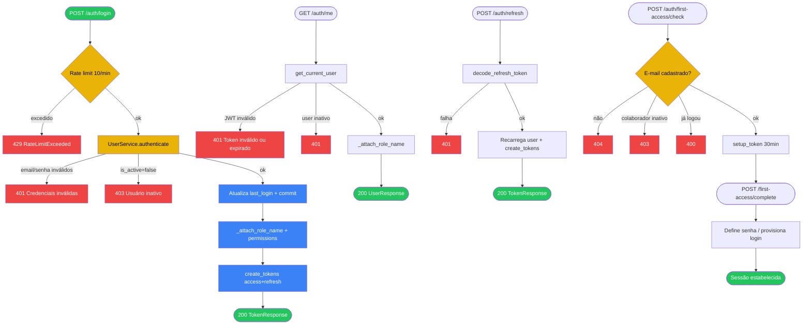

# 02 — Login JWT, refresh e primeiro acesso

## A. Metadados do processo

- *Nome do processo:* Autenticação unificada
- *Trigger:* `POST /api/v1/auth/login`, `POST /api/v1/auth/refresh`, `POST /api/v1/auth/first-access/*`, `GET /api/v1/auth/me`
- *Objetivo:* Emitir e renovar tokens JWT; validar utilizador ativo; provisionar senha no primeiro acesso a partir de colaborador TeamOps

## B. Matriz RACI simplificada

| Ator/Sistema | Papel no processo | Responsabilidade |
| :--- | :--- | :--- |
| Utilizador | R | Informa e-mail/senha ou completa primeiro acesso |
| `auth_router` | A | Endpoints HTTP e rate limit |
| `UserService` | R | Autenticação, first-access, hash bcrypt |
| Redis cache | C | Snapshot de utilizador (`auth:user:*`) |
| Frontend `AuthContext` | R | Persiste tokens e chama `/me` no boot |

## C. Fluxograma (Mermaid)

## D. Bifurcações e regras

| Condição | Sucesso | Exceção | Código referência |
| :--- | :--- | :--- | :--- |
| Credenciais inválidas | — | 401 `"Credenciais inválidas."` | `UserService.authenticate` |
| Utilizador inativo | — | 403 `"Usuário inativo."` | `UserService.authenticate` |
| Rate limit login | — | 429 | `@limiter.limit("10/minute")` em `login` |
| Token access inválido | — | 401 `"Token inválido ou expirado."` | `get_current_user` |
| Refresh sem type refresh | — | 401 | `decode_refresh_token` |
| Forgot/reset password | — | 403 (desativados no backend) | rotas auth |
| Senha fraca (first-access) | — | 422 / ValueError → validação | `validate_password_strength` |

### Strict mode

- `authenticate` e `get_current_user` usam `HTTPException` (não try/catch silencioso).
- Cache Redis de auth é **fail-open**: falha de Redis não bloqueia login (`core/cache.py`).
- Frontend: interceptor em `api/client.ts` tenta refresh em 401; se falhar, limpa sessão.

## E. Dicionário de dados

### JWT payload (`create_tokens`)

| Campo | Uso |
| :--- | :--- |
| `sub` | UUID do utilizador |
| `role` | `super_admin` \| `company_admin` \| `company_user` |
| `tenant_id` | UUID ou null (super_admin) |
| `exp` | Expiração |
| `type` | Só no refresh: `"refresh"` |

### Respostas

| Schema | Campos relevantes |
| :--- | :--- |
| `TokenResponse` | `access_token`, `refresh_token`, `user` |
| `UserResponse` | + `role_name`, `permissions`, `position_slug` (após `_attach_role_name`) |
| First-access check | `setup_token`, `full_name`, `email`, `message` |

### Regras de senha

Mín. 8 caracteres, maiúscula, minúscula, número e caractere especial (`validate_password_strength`).

## Rastreabilidade

- `backend/app/modules/super_admin/api/routes.py::login`
- `backend/app/modules/super_admin/api/routes.py::me`
- `backend/app/modules/super_admin/service.py::UserService.authenticate`
- `backend/app/modules/super_admin/service.py::UserService.check_first_access`
- `backend/app/core/security.py::get_current_user`
- `backend/app/core/security.py::create_tokens`
- `frontend/src/contexts/AuthContext.tsx`
- `frontend/src/modules/auth/LoginPage.tsx`
- `frontend/src/modules/auth/FirstAccessPage.tsx`
