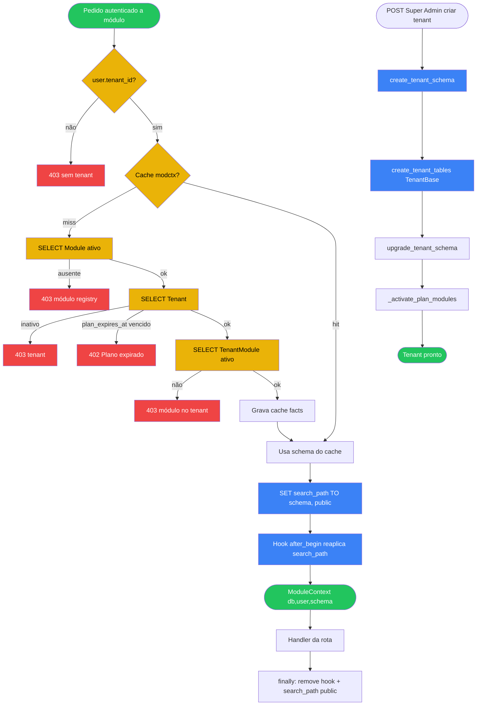

# 03 — Multitenancy e `require_module`

## A. Metadados do processo

- *Nome do processo:* Isolamento schema-per-tenant e abertura de contexto de módulo
- *Trigger:* Dependency `require_module("<slug>")` em rotas de negócio; criação de tenant no Super Admin
- *Objetivo:* Garantir que cada pedido de módulo opera no schema `tenant_<slug>` correto, com módulo ativo e plano válido

## B. Matriz RACI simplificada

| Ator/Sistema | Papel no processo | Responsabilidade |
| :--- | :--- | :--- |
| `TenantService.create_tenant` | R | Cria schema, tabelas e ativa módulos do plano |
| `require_module` | A | Valida registry + tenant + plano + tenant_modules |
| asyncpg pool | C | Reutiliza conexões — exige reset de `search_path` |
| Redis | C | Cache de factos `modctx_key(tenant, slug)` |
| `upgrade_tenant_schema` | R | DDL incremental pós-criação / no startup |

## C. Fluxograma (Mermaid)

## D. Bifurcações e regras

| Condição | Sucesso | Exceção | Código referência |
| :--- | :--- | :--- | :--- |
| Módulo inativo no registry | — | 403 | `require_module` |
| Tenant inativo | — | 403 | `require_module` |
| Plano expirado | — | 402 | `require_module` |
| Módulo não ativo no tenant | — | 403 | `require_module` |
| Commit na sessão tenant | Hook reaplica `search_path` | Sem hook → queries caem em `public` | `dependencies.py` after_begin |
| `get_db()` | Sempre `search_path=public` | — | `database.py::get_db` |
| Fim de `get_tenant_db` | Reseta `public` no finally | — | `database.py::get_tenant_db` |

### Strict mode

Validação de módulo/tenant usa `HTTPException` explícitas. Falhas de cache Redis não impedem o acesso (reconsulta Postgres).

Engine asyncpg: `prepared_statement_cache_size=0` / `statement_cache_size=0` para evitar contaminação entre schemas.

## E. Dicionário de dados

| Entidade (public) | Campos-chave |
| :--- | :--- |
| `Tenant` | `id`, `slug`, `schema_name`, `plan_id`, `is_active`, `plan_expires_at` |
| `Module` | `slug`, `is_active`, paths, icon |
| `TenantModule` | `tenant_id`, `module_slug`, `is_active`, `activated_at` |
| `ModuleContext` | `db`, `user`, `schema` |

Nome do schema: `tenant_{slug_sanitized}` via `_build_schema_name` em `TenantService`.

## Rastreabilidade

- `backend/app/core/dependencies.py::require_module`
- `backend/app/core/database.py::get_db`
- `backend/app/core/database.py::get_tenant_db`
- `backend/app/core/database.py::create_tenant_schema`
- `backend/app/core/database.py::create_tenant_tables`
- `backend/app/modules/super_admin/service.py::TenantService.create_tenant`
- `backend/app/core/tenant_migrations.py::upgrade_tenant_schema`
