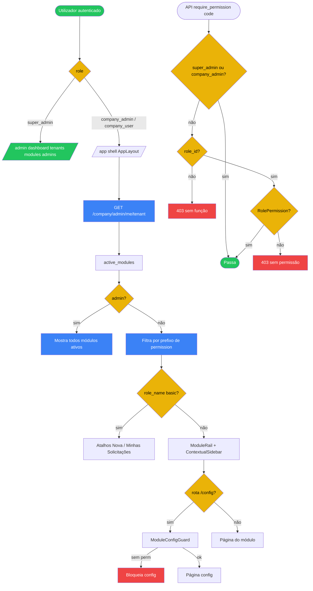

# 04 — Navegação, papéis e permissões

## A. Metadados do processo

- *Nome do processo:* Autorização em camadas e navegação do shell
- *Trigger:* Login / `/auth/me`; acesso a rotas frontend; dependency `require_permission` / guards de role
- *Objetivo:* Restringir rotas e menus conforme `UserRole`, Role do tenant, permissões por código e módulos ativos

## B. Matriz RACI simplificada

| Ator/Sistema | Papel no processo | Responsabilidade |
| :--- | :--- | :--- |
| Super Admin | A | Opera `/admin/*`; registry, planos, tenants |
| Company Admin | A | Usuários, funções, branding; bypass de permissões granulares |
| Company User | R | Opera módulos conforme `role_permissions` |
| `ProtectedRoute` | C | Filtra por `allowedRoles` |
| `moduleNavConfig` | C | Itens de sidebar por slug + `requiredAnyPermission` |
| TeamOps Position | C | Cargo pode ligar a Role (`position.role_id`) |

## C. Fluxograma (Mermaid)

## D. Bifurcações e regras

| Condição | Sucesso | Exceção | Código referência |
| :--- | :--- | :--- | :--- |
| Role não permitida na rota | — | Redirect `/dashboard` | `ProtectedRoute` |
| Sem auth | — | Redirect `/login` | `ProtectedRoute` |
| `company_user` sem `role_id` | — | 403 `"Usuário sem função atribuída."` | `require_permission` |
| Sem código na Role | — | 403 com nome do code | `require_permission` |
| Admins | `permissions: ["*"]` no payload | — | `_attach_role_name` |
| Limite de usuários do plano | — | Erro no POST user | `company` routes |

### Camadas (resumo)

1. `UserRole` — `require_super_admin` / `require_company_admin` / `require_authenticated`
2. Catálogo `module_permissions` — sync no startup
3. `roles` + `role_permissions` por tenant
4. `require_permission(code)`
5. `require_module(slug)`
6. Permissões por cargo TeamOps
7. Checks inline (ex.: projetos `_has_permission`)

## E. Dicionário de dados

| Tipo | Valores / campos |
| :--- | :--- |
| `UserRole` | `super_admin`, `company_admin`, `company_user` |
| `RolePermission` | `role_id`, `permission_code` |
| Frontend `User` | `permissions: string[]`, `role_name`, `position_slug` |
| Nav item | `to`, `label`, `requiredAnyPermission?` |

Exemplos de codes: `projetos.task.manage`, `teamops.person.view`, `rtd.manage`, `produtos.view`, `indicadores.manage`.

## Rastreabilidade

- `backend/app/core/security.py::require_super_admin`
- `backend/app/core/security.py::require_company_admin`
- `backend/app/core/dependencies.py::require_permission`
- `backend/app/core/permissions.py::sync_permissions`
- `frontend/src/components/ProtectedRoute.tsx`
- `frontend/src/modules/crm/AppLayout.tsx`
- `frontend/src/modules/crm/moduleNavConfig.ts`
- `frontend/src/components/ModuleConfigGuard.tsx`
- `frontend/src/lib/permissions.ts`
