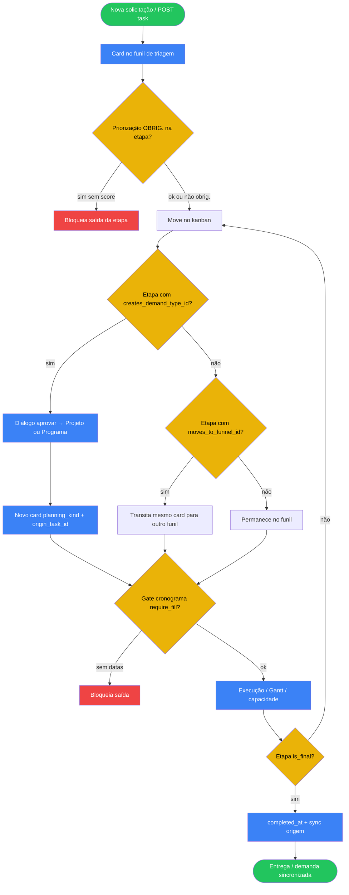

# 05 — Gestão de Processos (demandas / kanban / cronograma)

## A. Metadados do processo

- *Nome do processo:* Ciclo de vida de demanda → projeto/programa no módulo Processos
- *Trigger:* Rotas sob `/api/v1/projetos` com `require_module("projetos")`; UI em `/app/modules/projetos/*`
- *Objetivo:* Triar demandas, priorizar (Impacto × Esforço), converter em projeto/programa, planear cronograma, executar no kanban e reportar (PMO, SLA, status reports)

## B. Matriz RACI simplificada

| Ator/Sistema | Papel no processo | Responsabilidade |
| :--- | :--- | :--- |
| Solicitante (basic / company_user) | R | Abre solicitação; acompanha em Minhas Solicitações |
| Analista / PMO / Admin | A | Triagem, priorização, conversão, configuração de funis |
| Executor (assignee) | R | Move tarefas, comenta, preenche formulários de etapa |
| `ProjectTaskService` / serviços relacionados | R | Persistência, gates, automações, SLA |
| Celery `check_project_slas` | C | Scan periódico de SLA por tenant |
| Azure AI Foundry (opcional) | C | Agentes por etapa (`ProjectAgentRunner`) |

## C. Fluxograma (Mermaid)

## D. Bifurcações e regras

| Condição | Sucesso | Exceção | Código referência |
| :--- | :--- | :--- | :--- |
| Priorização OBRIG. sem pontuação | — | Movimento bloqueado (gate UI/API) | config status + priority services |
| Conversão `creates_demand_type_id` | Cria card filho com rastreio | Validação de tipo/nome | fluxo operacional + task service |
| Transição `moves_to_funnel_id` | Mesmo card muda de funil | Funil destino inválido | config de etapas |
| Cronograma `require_fill` | Exige `start_date` + `due_date` | Bloqueia saída | schedule bindings |
| Etapa final | `completed_at`; opcional `updates_origin_status_id` | — | status automations |
| Utilizador básico | Escopo às próprias solicitações | 403 em gestão ampla | `_is_basic_user` / `_has_permission` |
| Upload anexo | Objeto no MinIO | Erro storage | `POST /projetos/uploads` |

### Strict mode

Rotas usam `HTTPException` via services (404 task/projeto, 403 permissão). Agentes externos: texto anonimizado via `core/anonymize.py` antes de prompts.

## E. Dicionário de dados (principais)

| Entidade | Campos / notas |
| :--- | :--- |
| `Project` | Processo/kanban container |
| `ProjectFunnel` | Funil (triagem, planejamento, execução…) |
| `ProjectStatusConfig` | Etapa: SLA, gates, conversão, transição |
| `ProjectTask` | Card/demanda/tarefa; `planning_kind`, `origin_task_id` |
| `ProjectDemandType` | Tipo + formulário dinâmico |
| `ProjectPriority*` | Critérios, pilares, confiança, quadrantes |
| `ProjectScheduleBinding` | Onde cronograma é obrigatório |
| `ProjectAutomationRule` | Automações de entrada de etapa |
| `ProjectStatusReport` | Relatórios de status PMO |

Endpoints agregados: `/projects`, `/tasks`, `/programs`, `/capacity/*`, `/reports/*`, `/priority/*`, `/status-reports`, `/uploads`.

## Rastreabilidade

- `backend/app/modules/projetos/api/routes.py` (router completo)
- `backend/app/modules/projetos/service.py` (vários `*Service`)
- `backend/app/modules/projetos/permissions.py`
- `backend/app/modules/projetos/schedule_engine.py`
- `frontend/src/modules/projetos/*`
- Operacional alinhado a `docs/fluxo-projeto.md` e `docs/fluxo-programa.md`
