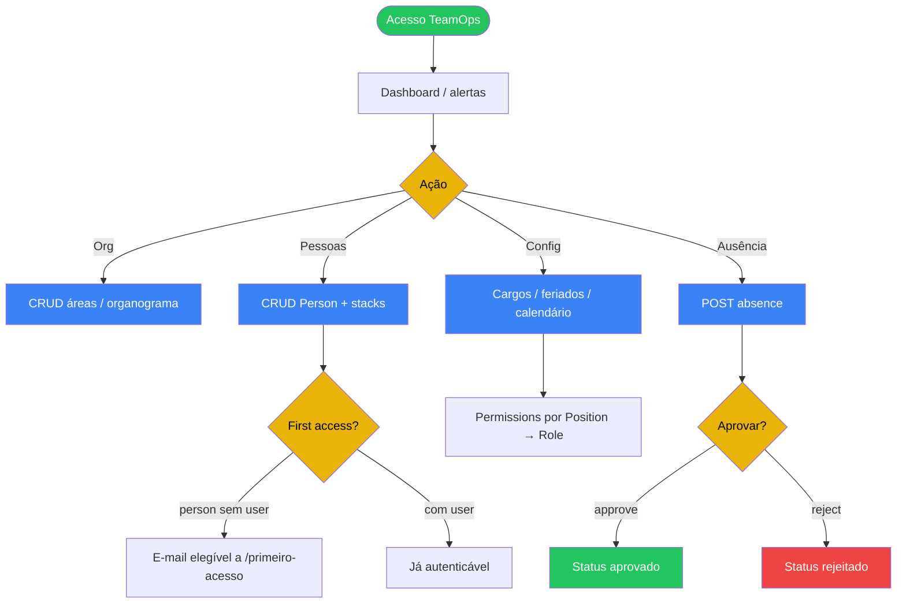

# 06 — TeamOps (times e capacidade)

## A. Metadados do processo

- *Nome do processo:* Gestão de pessoas, estrutura organizacional e ausências
- *Trigger:* `/api/v1/teamops/*` com `require_module("teamops")`
- *Objetivo:* Manter organograma, pessoas, stacks/competências, calendário de trabalho e fluxo de aprovação de ausências; alimentar capacidade do módulo Processos

## B. Matriz RACI simplificada

| Ator/Sistema | Papel no processo | Responsabilidade |
| :--- | :--- | :--- |
| Company Admin / gestor | A | Configura áreas, cargos, tipos de ausência |
| Colaborador | R | Solicita ausência; consulta dados próprios |
| Aprovador | A | Approve/reject ausências |
| `PersonService` | R | CRUD pessoas; provisionamento de login (first-access) |
| `PersonStatusSync` | C | Sincroniza status de pessoa |

## C. Fluxograma (Mermaid)

## D. Bifurcações e regras

| Condição | Sucesso | Exceção | Código referência |
| :--- | :--- | :--- | :--- |
| Sem permissão `teamops.*` | — | 403 | `require_permission` + nav `requiredAnyPermission` |
| Ausência approve/reject | Atualiza status | 403 se sem `teamops.absence.approve` | routes absences |
| Colaborador inativo | — | Bloqueia first-access 403 | `UserService.check_first_access` |
| Sem tabela `team_persons` no schema | Skip na busca cross-tenant | — | `_find_person_by_email` |

## E. Dicionário de dados

| Model | Uso |
| :--- | :--- |
| `Area` | Estrutura organizacional |
| `Position` | Cargo; pode ter `role_id` |
| `Person` | Colaborador (`team_persons`); e-mail, status, `user_id` |
| `PersonStack` / `Stack` / `StackCategory` | Competências |
| `Absence` / `AbsenceType` | Folgas / férias |
| `WorkCalendar` / `Holiday` | Capacidade e calendário |

Endpoints: `/dashboard`, `/alerts`, `/org/tree`, `/competency-map`, `/persons`, `/absences`, `/work-calendar`, `/holidays`, `/positions/{id}/permissions`.

## Rastreabilidade

- `backend/app/modules/teamops/api/routes.py`
- `backend/app/modules/teamops/service.py`
- `backend/app/modules/teamops/models.py`
- `backend/app/modules/teamops/permissions.py`
- `backend/app/modules/teamops/person_status_sync.py`
- `frontend/src/modules/teamops/*`
