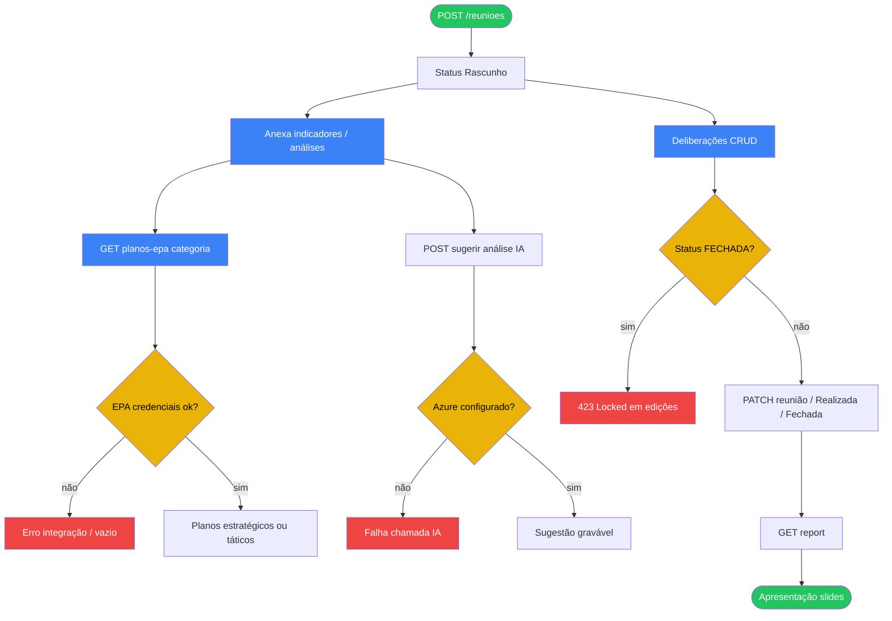

# 07 — RTD e integração EPA

## A. Metadados do processo

- *Nome do processo:* Reunião de Tomada de Decisão (RTD)
- *Trigger:* `/api/v1/rtd/*` com `require_module("rtd")`; UI `/app/modules/rtd/reunioes`
- *Objetivo:* Preparar e conduzir reuniões com indicadores, deliberações e slides de planos EPA (estratégico/tático); opcionalmente sugerir análises via Azure AI

## B. Matriz RACI simplificada

| Ator/Sistema | Papel no processo | Responsabilidade |
| :--- | :--- | :--- |
| Facilitador RTD (`rtd.manage`) | A | Cria/edita reunião, deliberações, análises |
| Participante (`rtd.view`) | C | Visualiza reuniões e slides |
| `EpaClient` | C | Login + grid de planos no sysepa |
| Azure AI Foundry | C | `sugerir` análise de indicador |
| Módulo Indicadores | C | Fonte de KPIs ligados à reunião |

## C. Fluxograma (Mermaid)

## D. Bifurcações e regras

| Condição | Sucesso | Exceção | Código referência |
| :--- | :--- | :--- | :--- |
| Mutação sem `rtd.manage` | — | 403 | routes RTD |
| Reunião `FECHADA` | Somente leitura efetiva | 423 | service RTD |
| EPA offline / credenciais | — | Erro HTTP ou lista vazia (conforme client) | `epa_client.py` |
| Categoria planos | `estrategico` \| `tatico` | Query inválida | `GET .../planos-epa` |

### Strict mode

Integração EPA depende de env: `EPA_API_BASE_URL`, `EPA_LOGIN`, `EPA_SENHA`, `EPA_PLANOS_ESTRATEGICO`, `EPA_PLANOS_TATICOS`. Se ausente, funcionalidade de planos fica **fora do repositório configurado** (hipótese de ambiente).

## E. Dicionário de dados

| Model | Uso |
| :--- | :--- |
| `RtdReuniao` | Reunião (status Rascunho / Realizada / Fechada) |
| `RtdDeliberacao` | Decisões registadas |
| `RtdIndicadorAnalise` | Análise por indicador na reunião |

## Rastreabilidade

- `backend/app/modules/rtd/api/routes.py`
- `backend/app/modules/rtd/service.py`
- `backend/app/modules/rtd/epa_client.py`
- `backend/app/modules/rtd/permissions.py`
- `frontend/src/modules/rtd/*`
- Documento auxiliar: `integracao-epa.md` (raiz do repo)
