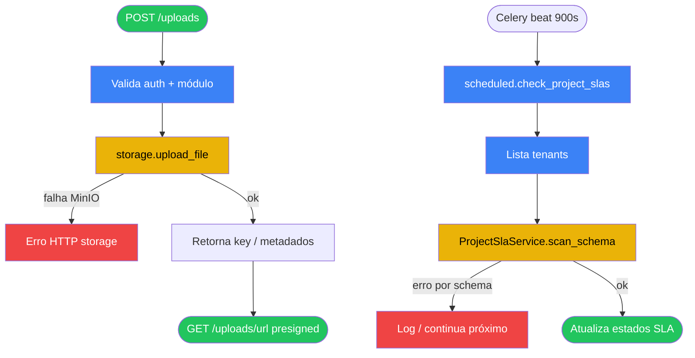

# 08 — Uploads MinIO e Celery (SLA)

## A. Metadados do processo

- *Nome do processo:* Armazenamento de ficheiros e tarefas assíncronas
- *Trigger:* `POST .../uploads` (projetos, produtos, indicadores); worker Celery beat/task SLA
- *Objetivo:* Persistência S3-compatible via MinIO com URLs pré-assinadas; varrer SLAs de projetos periodicamente

## B. Matriz RACI simplificada

| Ator/Sistema | Papel no processo | Responsabilidade |
| :--- | :--- | :--- |
| Utilizador autenticado no módulo | R | Envia ficheiro |
| `core/storage.py` | A | `upload_file`, `get_presigned_url`, `delete_object` |
| MinIO | C | Object storage |
| Celery + RabbitMQ | A | Broker e execução de tasks |
| `ProjectSlaService` | R | `scan_schema` por tenant |

## C. Fluxograma (Mermaid)

## D. Bifurcações e regras

| Condição | Sucesso | Exceção | Código referência |
| :--- | :--- | :--- | :--- |
| MinIO indisponível | — | Falha no upload (propagada à API) | `storage.py` |
| URL expirada | Cliente pede nova presigned | 403/erro S3 | `get_presigned_url` |
| Task SLA por tenant | Scan independente | Erro isolado não deve derrubar o lote (padrão log) | `tasks/scheduled.py` |
| Broker RabbitMQ down | — | Worker não consome | `celery_app.py` / env |

### Strict mode

Upload e Celery dependem de variáveis em `core/config.py` (`MINIO_*`, `CELERY_BROKER_URL`, `REDIS_URL`). Sem infraestrutura, estas funcionalidades ficam indisponíveis em runtime — não inventar fallbacks não presentes no código.

## E. Dicionário de dados

| Item | Descrição |
| :--- | :--- |
| Object key | Caminho lógico no bucket MinIO |
| Presigned URL | URL temporária GET |
| Task name | `scheduled.check_project_slas` |
| Intervalo | 900 segundos (config beat) |

## Rastreabilidade

- `backend/app/core/storage.py`
- `backend/app/core/celery_app.py`
- `backend/app/tasks/scheduled.py`
- Uploads: `projetos/api/routes.py`, `produtos/api/routes.py`, `indicadores/api/routes.py`
