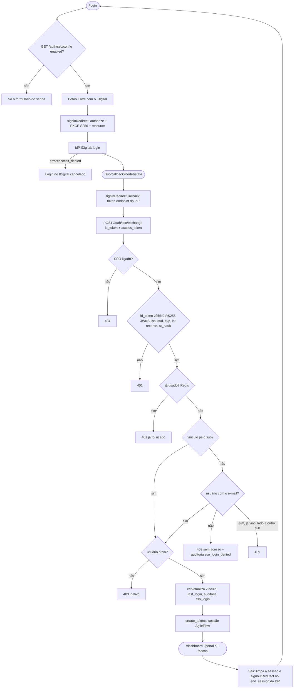

# 09 — Login pelo IDigital (SSO OIDC)

## A. Metadados do processo

- *Nome do processo:* Login "Entre com o IDigital" ao lado do login por senha
- *Trigger:* botão na tela `/login` → IdP IDigital → `GET /sso/callback` (front) → `POST /api/v1/auth/sso/exchange`
- *Objetivo:* colaboradores do Sistema FIEA entram com a conta IDigital; o AgileFlow continua emitindo a própria sessão (mesmos tokens do login por senha), então RBAC, tenant e o resto da API não mudam
- *Estado:* implementado e **desligado** (`SSO_ENABLED=false`) até o client `agileflow` ser cadastrado no IdP

Decisões:

- Vínculo pelo **e-mail** no 1º login; depois pelo `sub` do IDigital (tabela `public.user_sso_identities`).
- **Sem auto-cadastro**: e-mail sem usuário no AgileFlow é recusado (tenant, cargo e permissões são do admin).
- **Senha continua valendo** para todos. Clientes externos do Portal não têm IDigital e seguem com senha.

## B. Matriz RACI simplificada

| Ator/Sistema | Papel no processo | Responsabilidade |
| :--- | :--- | :--- |
| Colaborador | R | Clica em "Entre com o IDigital" e autentica no IdP |
| IdP IDigital | R | Authorization Code + PKCE, emite id_token (RS256) |
| `src/lib/sso.ts` (`oidc-client-ts`) | R | Monta o authorize (PKCE S256), troca o code no IdP, manda o id_token ao backend |
| `SsoService` (`super_admin/sso.py`) | A | Valida o id_token, controla reuso, acha/vincula o usuário, audita |
| `auth_router` | R | `GET /auth/sso/config`, `POST /auth/sso/exchange` (10/min) |
| Redis | C | Marca de uso único do id_token (`sso:idtoken:*`) |
| Admin do AgileFlow | C | Cadastra o usuário (e-mail) antes do 1º login SSO |

## C. Fluxograma (Mermaid)



## D. Bifurcações

| Situação | Resposta | Onde |
| :--- | :--- | :--- |
| SSO desligado ou sem `SSO_CLIENT_ID` | config `{"enabled": false}`; troca 404 | `SsoService.enabled()` |
| Assinatura, `alg` ≠ RS256, `kid` desconhecido, `aud` ≠ client, `iss` ≠ discovery | 401 | `verify_id_token` |
| `exp` vencido ou `iat` mais velho que `SSO_MAX_TOKEN_AGE` (600 s) | 401 "expirou" | `verify_id_token` |
| `at_hash` sem access_token ou que não bate | 401 | `jwt.decode(..., access_token=)` |
| Mesmo id_token pela 2ª vez | 401 "já foi usado" (Redis fora: segue, fail-open) | `_mark_used` |
| Sem e-mail no id_token nem no userinfo | 401 | `_email` |
| E-mail sem usuário | 403 + `audit_logs.action = sso_login_denied` | `exchange` |
| Usuário já ligado a outra conta IDigital | 409 | `exchange` |
| Usuário inativo | 403 (não ganha vínculo) | `exchange` |
| Discovery/JWKS fora do ar | 503 (usa o cache se houver) | `metadata`, `signing_key` |

Logout: se a sessão veio do SSO (`localStorage.auth_via = "sso"`), o "Sair" também encerra no IdP (`end_session` com `id_token_hint` e `post_logout_redirect_uri = /login`). Sessão por senha não passa pelo IdP.

## E. Dicionário de dados

`public.user_sso_identities` (Alembic `007`):

| Coluna | Tipo | Regra |
| :--- | :--- | :--- |
| `id` | UUID PK | |
| `user_id` | UUID FK `users.id` (CASCADE) | único por `provider` |
| `provider` | varchar(30) | hoje `idigital` |
| `subject` | varchar(255) | `sub` do IdP; único por `provider` |
| `email` | varchar(255) | e-mail informado no último login |
| `linked_at` | timestamp | 1º login SSO |
| `last_login_at` | timestamp | último login SSO |

O CPF (`document`) que o IdP oferece **não** é pedido nem guardado.

## F. Fatos do IdP (discovery de produção)

- Discovery: `https://sso.idigital.sistemafiea.com.br/sso/oidc/.well-known/openid-configuration`
- `iss` dos tokens: `https://sso.idigital.sistemafiea.com.br` (**sem** `/sso/oidc`, diferente do que a doc do SDK chama de issuer). O backend usa o `issuer` da discovery.
- `token_endpoint_auth_methods`: só `none` → client público + PKCE (sem `client_secret`).
- Sem grant `refresh_token` → a sessão longa é a do AgileFlow.
- RS256, JWKS em `/sso/oidc/jwks`; backchannel logout suportado (fase 2).

Por que `oidc-client-ts` direto e não o pacote `@fiea-al/idigital-sso-sdk`: o SDK é uma camada fina sobre a mesma biblioteca (mesma configuração), mas vem de feed npm privado (exigiria PAT no build Docker) e o botão dele carrega a fonte do Google Fonts, bloqueada pela CSP. `src/lib/sso.ts` expõe as mesmas operações; trocar pelo pacote depois é local.

## G. Como ligar

1. Cadastro do client no IdP (pedido ao time do IDigital):

   | Item | Valor |
   | :--- | :--- |
   | client_id | `agileflow` — público, `token_endpoint_auth_method=none`, PKCE S256 |
   | redirect_uris | `https://agileflow.tdsistemafiea.com.br/sso/callback` |
   | post_logout_redirect_uris | `https://agileflow.tdsistemafiea.com.br/login` |
   | resource | `https://agileflow.tdsistemafiea.com.br` |
   | corsOrigins | `https://agileflow.tdsistemafiea.com.br` |
   | grant / response | `authorization_code` / `code` |
   | scopes | `openid email profile` (sem `document`) |
   | Confirmar | o id_token traz `email`? access token é JWT ou opaco? há IdP de homologação? |

2. `.env` do servidor:

   ```ini
   SSO_ENABLED=true
   SSO_AUTHORITY=https://sso.idigital.sistemafiea.com.br/sso/oidc
   SSO_CLIENT_ID=agileflow
   SSO_RESOURCE=https://agileflow.tdsistemafiea.com.br
   ```

3. `docker compose up -d api` (a API relê o `.env`; o front lê a config em runtime por `/auth/sso/config`, sem rebuild).
4. CSP: `frontend/nginx.conf` já libera `https://sso.idigital.sistemafiea.com.br` em `connect-src`. Outro host de IdP (homologação) precisa entrar ali e exige rebuild do front.
5. Smoke: login → callback → cai na área certa → "Sair" volta ao `/login` passando pelo IdP.

## H. Testes

`provisorio/testes-e2e/sso-idigital-2026-09-23/run.sh`: backend com IdP falso (chave RSA do teste, transação desfeita) e telas com o IdP simulado no Playwright (CSP e PKCE reais). Não liga o SSO no servidor.
