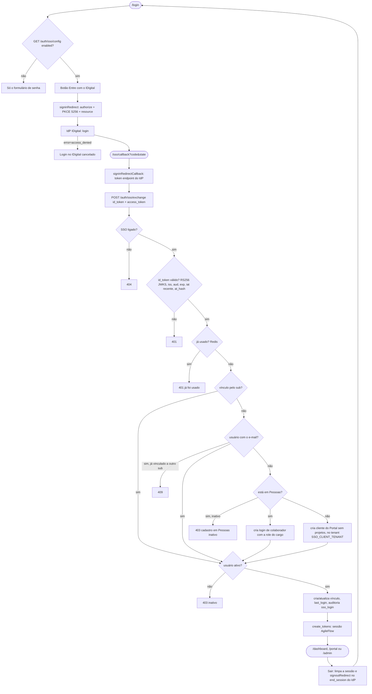

# 09 — Login pelo IDigital (SSO OIDC)

## A. Metadados do processo

- *Nome do processo:* Login "Entre com o IDigital" ao lado do login por senha
- *Trigger:* botão na tela `/login` → IdP IDigital → `GET /sso/callback` (front) → `POST /api/v1/auth/sso/exchange`
- *Objetivo:* colaboradores do Sistema FIEA entram com a conta IDigital; o AgileFlow continua emitindo a própria sessão (mesmos tokens do login por senha), então RBAC, tenant e o resto da API não mudam
- *Estado:* **ligado em produção** desde 23/09/2026 (client público cadastrado no IdP; `SSO_*` no `.env` do servidor). Padrão do código continua `SSO_ENABLED=false`

Decisões:

- Vínculo pelo **e-mail** no 1º login; depois pelo `sub` do IDigital (tabela `public.user_sso_identities`).
- 1º login de quem ainda **não tem login** no AgileFlow:
  - está em **Pessoas** (TeamOps) → ganha o login de **colaborador** com a role do cargo (mesma regra do 1º acesso);
  - **não está em Pessoas** → vira **cliente** do Portal (Operação Assistida), sem projetos; o PO vincula os projetos na tela Clientes.
- **Senha continua valendo** para todos. Clientes cadastrados pelo PO sem IDigital seguem com senha.

## B. Matriz RACI simplificada

| Ator/Sistema | Papel no processo | Responsabilidade |
| :--- | :--- | :--- |
| Colaborador | R | Clica em "Entre com o IDigital" e autentica no IdP |
| IdP IDigital | R | Authorization Code + PKCE, emite id_token (RS256) |
| `src/lib/sso.ts` (`oidc-client-ts`) | R | Monta o authorize (PKCE S256), troca o code no IdP, manda o id_token ao backend |
| `SsoService` (`super_admin/sso.py`) | A | Valida o id_token, controla reuso, acha/vincula o usuário, audita |
| `auth_router` | R | `GET /auth/sso/config`, `POST /auth/sso/exchange` (10/min) |
| Redis | C | Marca de uso único do id_token (`sso:idtoken:*`) |
| Admin do AgileFlow | C | Cadastra o usuário (e-mail) antes do 1º login SSO |

## C. Fluxograma (Mermaid)



## D. Bifurcações

| Situação | Resposta | Onde |
| :--- | :--- | :--- |
| SSO desligado ou sem `SSO_CLIENT_ID` | config `{"enabled": false}`; troca 404 | `SsoService.enabled()` |
| Assinatura, `alg` ≠ RS256, `kid` desconhecido, `aud` ≠ client, `iss` ≠ discovery | 401 | `verify_id_token` |
| `exp` vencido ou `iat` mais velho que `SSO_MAX_TOKEN_AGE` (600 s) | 401 "expirou" | `verify_id_token` |
| `at_hash` sem access_token ou que não bate | 401 | `jwt.decode(..., access_token=)` |
| Mesmo id_token pela 2ª vez | 401 "já foi usado" (Redis fora: segue, fail-open) | `_mark_used` |
| Sem e-mail no id_token nem no userinfo | 401 | `_email` |
| E-mail sem usuário, está em Pessoas (ativo) | cria login de colaborador (role do cargo), auditoria `provisioned = colaborador` | `_provision_collaborator` |
| E-mail sem usuário, está em Pessoas (inativo) | 403, nada é criado | `_provision` |
| E-mail sem usuário e fora de Pessoas | cria cliente do Portal sem projetos, auditoria `provisioned = cliente` | `_provision_client` |
| Tenant de clientes (`SSO_CLIENT_TENANT`) inexistente | 403 + `sso_login_denied` | `_provision` |
| Usuário já ligado a outra conta IDigital | 409 | `exchange` |
| Usuário inativo | 403 (não ganha vínculo) | `exchange` |
| Discovery/JWKS fora do ar | 503 (usa o cache se houver) | `metadata`, `signing_key` |

Logout: se a sessão veio do SSO (`localStorage.auth_via = "sso"`), o "Sair" também encerra no IdP (`end_session` com `id_token_hint` e `post_logout_redirect_uri = /login`). Sessão por senha não passa pelo IdP.

## E. Dicionário de dados

`public.user_sso_identities` (Alembic `007`):

| Coluna | Tipo | Regra |
| :--- | :--- | :--- |
| `id` | UUID PK | |
| `user_id` | UUID FK `users.id` (CASCADE) | único por `provider` |
| `provider` | varchar(30) | hoje `idigital` |
| `subject` | varchar(255) | `sub` do IdP; único por `provider` |
| `email` | varchar(255) | e-mail informado no último login |
| `linked_at` | timestamp | 1º login SSO |
| `last_login_at` | timestamp | último login SSO |

O CPF (`document`) que o IdP oferece **não** é pedido nem guardado.

### O que vem do IDigital no cadastro automático

| Campo | Cliente (`project_clients` + login) | Colaborador (login de quem está em Pessoas) |
| :--- | :--- | :--- |
| E-mail | `email` do IDigital | `email` (é o que casa com Pessoas) |
| Nome | `name` → `displayName` → `given_name` + `family_name` → `firstName` + `lastName` → `preferred_username`/`nickname` → parte local do e-mail | o de Pessoas (fonte da verdade do colaborador) |
| Telefone, organização, departamento | não existem no IdP; o departamento vem da folha (Genus) se estiver vazio; o resto o PO completa em Clientes | seguem de Pessoas; dados da folha na ficha (abaixo) |
| Observação | "Cadastro criado no 1º login pelo IDigital em dd/mm/aaaa. Vincule os projetos em Clientes." | — |
| Projetos | nenhum (o PO vincula) | os do cargo/permissões |
| CPF (`document`) | não pedido nem guardado (LGPD) — nem do IdP nem da folha | idem |

Senha: quem nasce pelo SSO recebe uma senha aleatória que ninguém conhece (entra pelo IDigital). Colaborador pode ter senha redefinida pelo admin em Pessoas.

### Dados da folha (Genus) no 1º login

No 1º login pelo IDigital de cada usuário (quando nasce o vínculo em `user_sso_identities` — login novo, colaborador ou cliente), o backend agenda a tarefa Celery `payroll.sync_user`, que consulta a folha FIEA pelo e-mail:

`GET {GENUS_API_URL}/api/payroll/users?email=<e-mail>` com `Authorization: Bearer {GENUS_API_TOKEN}`.

| Campo da API | Onde fica | Observação |
| :--- | :--- | :--- |
| `employeeNumber` | `user_payroll_profiles.employee_number` | matrícula |
| `organization` | `organization` | código da entidade, como vem (ex.: `2`) |
| `department` | `department` | também preenche `project_clients.department` do cliente do Portal, se estiver vazio |
| `role` | `job_title` | cargo funcional da folha — **não** é o Cargo do TeamOps |
| `trustRole` | `trust_role` | função de confiança |
| `updatedAt` | `source_updated_at` | texto, como vem |
| `document` | — | CPF: **descartado** antes de gravar ou logar |

- Só vale o item cujo `email` é exatamente o do usuário. Sem item: auditoria `payroll_lookup` com `found = false` e nada gravado.
- Nunca atrasa nem derruba o login: roda fora da requisição (`send_task(..., retry=False)`); fila fora do ar só gera log.
- Genus fora do ar, bloqueado ou sem JSON (`PayrollUnavailable`): nova tentativa em 1 min, 5 min, 25 min, ~2 h, 6 h e 6 h; depois desiste.
- Auditoria `payroll_lookup` registra só quais campos vieram, nunca os valores.
- Exibição: ficha da Pessoa → aba Organização → "Dados da folha" (só no detalhe, que exige `teamops.person.view`).
- Sem `GENUS_API_TOKEN` a consulta fica desligada.

`public.user_payroll_profiles` (Alembic `008`): `id`, `user_id` (FK `users.id` CASCADE, único), `source` (`genus`), `employee_number`, `organization`, `department`, `job_title`, `trust_role`, `source_updated_at`, `fetched_at`.

**Pré-requisito de rede:** o `genusapi.sistemafiea.com.br` fica atrás do Cloudflare, que em 2026-09-24 recusava (403, página "Attention Required") o IP de saída do servidor do AgileFlow — `187.124.129.85` / `2a02:4780:c:62de::1`, datacenter na Lituânia. Enquanto o IP não for liberado no WAF, as tentativas falham e o log do worker mostra `Genus recusou pelo Cloudflare (HTTP 403)`.

Para buscar os dados de quem já tinha entrado pelo IDigital antes (depois de liberar o IP):

```bash
docker exec saas_api python -c "
from sqlalchemy import create_engine, text
from app.core.config import settings
from app.core.celery_app import celery_app
eng = create_engine(settings.DATABASE_URL.replace('+asyncpg', ''))
with eng.connect() as c:
    ids = [str(r[0]) for r in c.execute(text('''SELECT DISTINCT s.user_id FROM public.user_sso_identities s
        LEFT JOIN public.user_payroll_profiles p ON p.user_id = s.user_id WHERE p.id IS NULL'''))]
for uid in ids:
    celery_app.send_task('payroll.sync_user', args=[uid])
print(len(ids), 'agendados')
"
```

## F. Fatos do IdP (discovery de produção)

- Discovery: `https://sso.idigital.sistemafiea.com.br/sso/oidc/.well-known/openid-configuration`
- `iss` dos tokens: `https://sso.idigital.sistemafiea.com.br` (**sem** `/sso/oidc`, diferente do que a doc do SDK chama de issuer). O backend usa o `issuer` da discovery.
- `token_endpoint_auth_methods`: só `none` → client público + PKCE (sem `client_secret`).
- Sem grant `refresh_token` → a sessão longa é a do AgileFlow.
- RS256, JWKS em `/sso/oidc/jwks`; backchannel logout suportado (fase 2).

Por que `oidc-client-ts` direto e não o pacote `@fiea-al/idigital-sso-sdk`: o SDK é uma camada fina sobre a mesma biblioteca (mesma configuração), mas vem de feed npm privado (exigiria PAT no build Docker) e o botão dele carrega a fonte do Google Fonts, bloqueada pela CSP. `src/lib/sso.ts` expõe as mesmas operações; trocar pelo pacote depois é local.

## G. Como ligar

1. Cadastro do client no IdP (pedido ao time do IDigital):

   Na tela do IdP ("Cliente de autenticação"): URI de redirecionamento, Servidor de Recurso e URI pós logout como abaixo; URI de logout backchannel **vazia** (fase 2). O IdP gera o client ID, que vai em `SSO_CLIENT_ID`.

   | Item | Valor |
   | :--- | :--- |
   | client_id | gerado pelo IdP — público, `token_endpoint_auth_method=none`, PKCE S256 |
   | redirect_uris | `https://agileflow.tdsistemafiea.com.br/sso/callback` |
   | post_logout_redirect_uris | `https://agileflow.tdsistemafiea.com.br/login` |
   | resource | `https://agileflow.tdsistemafiea.com.br` |
   | corsOrigins | `https://agileflow.tdsistemafiea.com.br` |
   | grant / response | `authorization_code` / `code` |
   | scopes | `openid email profile` (sem `document`) |
   | Confirmar | o id_token traz `email`? access token é JWT ou opaco? há IdP de homologação? |

2. `.env` do servidor:

   ```ini
   SSO_ENABLED=true
   SSO_AUTHORITY=https://sso.idigital.sistemafiea.com.br/sso/oidc
   SSO_CLIENT_ID=agileflow
   SSO_RESOURCE=https://agileflow.tdsistemafiea.com.br
   ```

3. `docker compose up -d api` (a API relê o `.env`; o front lê a config em runtime por `/auth/sso/config`, sem rebuild).
4. CSP: `frontend/nginx.conf` já libera `https://sso.idigital.sistemafiea.com.br` em `connect-src`. Outro host de IdP (homologação) precisa entrar ali e exige rebuild do front. Atenção: hoje o `location /` tem `add_header` próprio e o nginx não repassa a CSP do `server` para o HTML (a CSP não está ativa na página); ao corrigir isso, manter o host do IdP no `connect-src`.
5. Smoke: login → callback → cai na área certa → "Sair" volta ao `/login` passando pelo IdP.

## H. Testes

`provisorio/testes-e2e/sso-idigital-2026-09-23/run.sh`: backend com IdP falso (chave RSA do teste, transação desfeita) e telas com o IdP simulado no Playwright (CSP e PKCE reais). Não liga o SSO no servidor.
