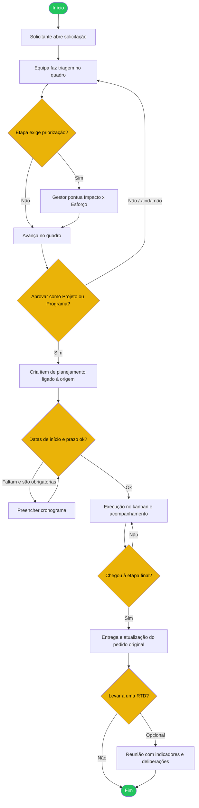

# 05 — Fluxo de processo de negócio

Visão **não técnica** do ciclo principal do AgileFlow: da abertura de uma solicitação até a entrega, com apoio de times, indicadores e RTD quando a empresa usa esses módulos.

Alinhado a [`docs/processo/01-fluxo-processo-negocio-bpmn.xml`](../processo/01-fluxo-processo-negocio-bpmn.xml) e [`docs/processo/02-documentacao-processo.md`](../processo/02-documentacao-processo.md).

## Atores

| Ator | Papel |
| :--- | :--- |
| Solicitante | Abre e acompanha o pedido |
| Gestor / PMO | Triagem, priorização, aprovação |
| Equipa de execução | Planeja e desenvolve até entregar |
| Admin da empresa | Configura tipos, etapas e permissões (fora do fluxo diário) |
| Facilitador RTD | (Opcional) Leva indicadores e planos à reunião de decisão |

## Diagrama (linguagem de negócio)

## Passo a passo

1. **Abertura** — O solicitante escolhe o tipo e preenche o formulário (**Nova Solicitação**).
2. **Triagem** — O card aparece no quadro configurado pela empresa.
3. **Priorização** — Quando a etapa exige, o gestor completa a matriz Impacto × Esforço (Quick Win, Big Bet, etc.).
4. **Aprovação** — Em etapas preparadas para isso, aprova-se a criação de um **Projeto** (um item) ou **Programa** (vários projetos).
5. **Cronograma** — Definem-se início e prazo; em algumas etapas isso é obrigatório para avançar.
6. **Execução** — O trabalho caminha nas etapas de desenvolvimento (SLA e capacidade ajudam a gestão).
7. **Entrega** — Na etapa final o item conclui; o pedido original pode ser atualizado automaticamente.
8. **RTD (opcional)** — Indicadores e planos podem ser discutidos numa Reunião de Tomada de Decisão.

## Regras de negócio (visão utilizador)

- Sem priorização obrigatória preenchida, o card **não sai** da etapa.
- Sem datas obrigatórias, o card **não avança**.
- Projeto e demanda de origem ficam **ligados** (é possível navegar entre eles).
- Reunião RTD **fechada** não deve mais ser editada.

## Mapa documental

| Artefacto | Onde |
| :--- | :--- |
| Guias de ecrã | `docs/usuario/01`–`04` |
| BPMN 2.0 | `docs/processo/01-fluxo-processo-negocio-bpmn.xml` |
| Ficha tabular | `docs/processo/02-documentacao-processo.md` |
| Detalhe operacional projeto | `docs/fluxo-projeto.md` |
| Detalhe operacional programa | `docs/fluxo-programa.md` |
